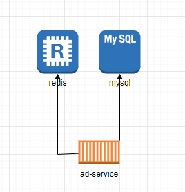

## 개요
캠페인의 조회 전용 시스템입니다.

## 시스템 구성도


## 설계
프로젝트는 DDD기반 레이어드 아키텍처로 구성.
조회 전용 시스템으로 조회시 같이 묶이는 엔티티로 패키지를 묶어서 구현.

* 주요 패키지 설명
    * campaign : 광고 및 컨텐츠 조회
    * common : 공통에러처리, jackson설정등, 스프링과 같은 라이브러리에 의존.
    * core : 어떤 레이어에도 의존적이지 않고, 외부 라이브러리에 의존적이지 않은 순수 자바 코드만으로 구현.

## Tech Stack
1. 언어
    1. [java17](https://docs.aws.amazon.com/corretto/latest/corretto-17-ug/downloads-list.html)
2. 주요 라이브러리
    1. 스프링 부트 2.7
    2. jpa
    3. [flyway](https://blog.gangnamunni.com/post/introducing-flyway/) : db스키마 변경 이력 관리
3. 주요 캐시 전략
    1. 레디스
       * 광고, 컨텐츠아이디를 sorted set에 firstDisplayPriority 기준으로 정렬하여 저장.
    2. 로컬
       * 최우선 순위광고를 로컬 캐시에 저장. 일단위 스케줄러가 리프레시.

## 테스트
* 테스트 실행시 flyway에서 스키마 및 테스트 데이터 입력.
* 스프링 부트 실행시 ApplicationReadyEvent를 구독하여 RedisTestDataLoader 클래스에서 레디스로 테스트 데이터가 입력됨.

# 로컬 환경 설정
## Prerequisite
* [Docker](https://www.docker.com/get-started) 설치 & 로그인 (tested on v20.10.17)
* [java17](https://docs.aws.amazon.com/corretto/latest/corretto-17-ug/downloads-list.html) 설치

## build 및 도커 컨테이너 실행

```bash
./gradlew build --exclude-task test # jar파일 생성(라이브러리를 설치하거나 의존성이 바뀐 경우 다시 빌드해야함)
docker compose up --build -d # 빌드 및 컨테이너 실행
./gradlew clean # 정리하기
./gradlew build # 테스트 실행. redis가 실행 되고있어야함.
```

## 실행 확인
```text
http://localhost:8080/config
```

## 도커 컨테이너 중지
```bash
docker container ls # 실행중인 컨테이너 확인
docker container stop ad-service-practice # 애플리케이션 중지
docker container stop ad-service-mysql # mysql 중지
docker container stop ad-service-redis # redis 중지
```
